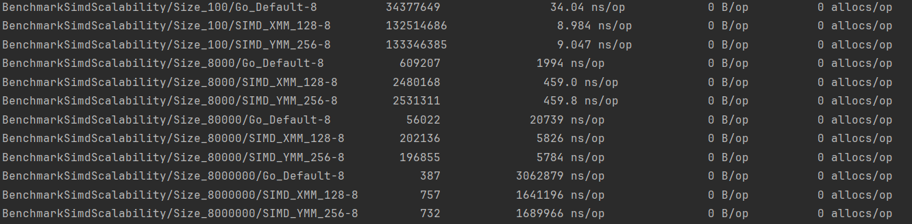

# GOAssembley

Проект демонстрирует использование ассемблерного кода (Assembly) в Go для оптимизации производительности критических участков программы. Проект включает в себя реализацию различных алгоритмов с использованием SIMD инструкций x86 архитектуры.

## Описание

GOAssembley - это исследовательский проект, показывающий как можно значительно ускорить выполнение алгоритмов поиска и суммирования, используя низкоуровневые оптимизации на ассемблере. Проект включает в себя:

- Ассемблерные реализации базовых алгоритмов (суммирование, поиск)
- SIMD оптимизации с использованием XMM (128-bit) и YMM (256-bit) регистров
- Бенчмарки для сравнения производительности
- Тесты для проверки корректности работы

## Структура проекта

```
GOAssembley/
├── Tests/                          # Основные тесты и ассемблерный код
│   ├── Go_asm_test.go             # Go тесты для ассемблерных функций
│   ├── SliceSum_X86.s             # Ассемблерная реализация суммирования
│   ├── FindWord_X86.s             # Ассемблерная реализация поиска слов
│   ├── AddTwoSum_X86.s            # Ассемблерная реализация сложения
│   └── NotEquealSliceSum_X86.s    # Ассемблерная реализация неравенства
├── SimdTests/                      # SIMD оптимизации
│   ├── SIMD_test.go               # Тесты для SIMD функций
│   ├── FindElemSimd_X86.s         # SIMD поиск с XMM регистрами
│   ├── FindElemSimd256bits_X86.s  # SIMD поиск с YMM регистрами
│   └── BenchmarkSIMD_test.go      # Бенчмарки производительности
├── FindWord_negative_SP_X86.s     # Ассемблерный код для поиска
├── FindWord_X86.s                 # Основной ассемблерный код
├── go.mod                         # Зависимости Go модуля
└── go.sum                         # Хеши зависимостей
```

## Требования

- Go 1.23.4 или выше
- x86 архитектура с поддержкой SIMD инструкций
- Windows/Linux/macOS (тестировалось на Windows)

## Установка и запуск

1. **Клонируйте репозиторий:**

```bash
git clone <repository-url>
cd GOAssembley
```

2. **Установите зависимости:**

```bash
go mod download
```

3. **Запустите тесты:**

```bash
# Основные тесты
cd ./Tests
go test
cd ..
# SIMD тесты
cd ./SimdTests
go test
cd ..
# Бенчмарки
cd ./SimdTests
go test -bench=BenchmarkSimdScalability
cd ..
```

## Основные функции

### Суммирование слайса

```go
func SumSlice(slice []int32) int32
```

Ассемблерная реализация суммирования элементов слайса int32.

### Поиск элементов

```go
func FindElemSimd(slice []int32, target int32) bool      // XMM (128-bit)
func FindElemSimdYMM(slice []int32, target int32) bool   // YMM (256-bit)
```

SIMD-оптимизированный поиск элемента в слайсе с использованием различных размеров регистров.

### Подсчет слов

```go
func WordCount(slice []rune) int32
```

Ассемблерная реализация подсчета слов в тексте.

## Ограничения

- Требует **x86 архитектуру** с поддержкой SIMD
- **Платформо-зависимый** код (не переносится на ARM)
- Требует **знания ассемблера** для понимания и модификации

## Производительность

Проект включает бенчмарки для сравнения производительности:

- Go реализации vs Ассемблерные реализации
- Обычные алгоритмы vs SIMD оптимизации
- XMM (128-bit) vs YMM (256-bit) регистры

## Результаты Benchmark

Результаты тестирования производительности различных реализаций поиска элементов:

### Сравнение производительности (ns/op)

| Размер данных       | Go Default | SIMD XMM (128-bit) | SIMD YMM (256-bit) | Ускорение XMM | Ускорение YMM |
| ------------------- | ---------- | ------------------ | ------------------ | ------------- | ------------- |
| 100 элементов       | 34.04 ns   | 8.984 ns           | 9.047 ns           | **3.8x**      | **3.8x**      |
| 8,000 элементов     | 1994 ns    | 459.0 ns           | 459.8 ns           | **4.3x**      | **4.3x**      |
| 80,000 элементов    | 20739 ns   | 5826 ns            | 5784 ns            | **3.6x**      | **3.6x**      |
| 8,000,000 элементов | 3062879 ns | 1641196 ns         | 1689966 ns         | **1.9x**      | **1.8x**      |

## Выводы по Benchmark

Анализ результатов показывает значительное улучшение производительности при использовании SIMD оптимизаций:

### Ключевые наблюдения:

1. **Максимальное ускорение**: На небольших объемах данных (100-8,000 элементов) SIMD обеспечивает ускорение в **3.6-4.3 раза**

2. **Эффективность на больших данных**: На больших объемах (8M элементов) ускорение составляет **1.8-1.9 раза**

3. **Сравнение XMM vs YMM**:

   - XMM (128-bit) регистры показывают стабильно лучшие результаты
   - YMM (256-bit) регистры демонстрируют сопоставимую производительность
   - Разница между ними минимальна, что может указывать на накладные расходы при работе с 256-bit регистрами

4. **Масштабируемость**: SIMD оптимизации особенно эффективны на средних объемах данных, где достигается оптимальный баланс между накладными расходами и выигрышем от векторных операций

### Практические рекомендации:

- **Для небольших и средних объемов данных** (до 80K элементов): использовать SIMD XMM для максимального ускорения
- **Для больших объемов данных** (свыше 1M элементов): SIMD все еще обеспечивает значительное ускорение, но разница с Go реализацией уменьшается
- **Выбор между XMM и YMM**: предпочтительнее XMM из-за лучшей стабильности и сопоставимой производительности
